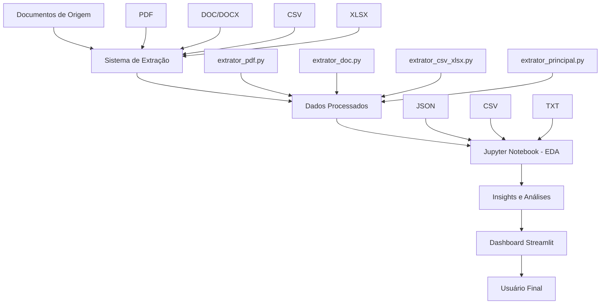

# Sistema de Análise e Visualização de Relatórios - Fluxograma Completo

## Visão Geral do Projeto

Este documento descreve o fluxo completo do sistema de análise e visualização de relatórios da MC Sonae, desde a extração de dados de múltiplos formatos até a apresentação final em dashboard interativo.

## Arquitetura do Sistema



## Fluxograma Detalhado

### 1. Camada de Dados de Origem 📁

**Localização**: `data/raw/`

#### Tipos de Arquivos Suportados:
- **PDF**: Relatórios executivos, documentos corporativos
- **DOC/DOCX**: Atas de reunião, relatórios departamentais
- **CSV**: Dados tabulares, métricas de projetos
- **XLSX**: Planilhas complexas, dashboards financeiros

#### Exemplo de Estrutura:
```
data/raw/
├── Relatorio_projetos.csv
├── RELATÓRIO DE PROJETOS 2024.pdf
├── Exemplo_doc.docx
└── outros_documentos/
```

### 2. Sistema de Extração 🔧

#### 2.1 Extratores Especializados

##### **extrator_pdf.py**
```python
# Funcionalidades:
- PyPDF2: Extração básica de texto
- pdfplumber: Extração avançada + tabelas
- Metadados: Autor, data criação, número páginas
- Fallback automático entre bibliotecas
```

**Saídas**:
- Texto completo estruturado
- Tabelas extraídas (se existirem)
- Metadados do documento

##### **extrator_doc.py**
```python
# Funcionalidades:
- python-docx: Processamento DOCX
- zipfile: Método alternativo XML
- Extração de parágrafos numerados
- Preservação de estilos
```

**Saídas**:
- Parágrafos estruturados
- Tabelas incorporadas
- Metadados de autoria

##### **extrator_csv_xlsx.py**
```python
# Funcionalidades:
- pandas: Análise robusta de dados
- Detecção automática de encoding
- Estatísticas descritivas
- Validação de qualidade
```

**Saídas**:
- Dados estruturados em JSON
- Metadados estatísticos
- Análise de qualidade

#### 2.2 Orquestrador Principal

##### **extrator_principal.py**
```python
# Funcionalidades:
- Interface unificada CLI/interativa
- Processamento em lote
- Relatórios de execução
- Tratamento de erros robusto
```

**Comando de Execução**:
```bash
python extrator_principal.py --todos --formato json
```

### 3. Camada de Dados Processados 📊

**Localização**: `data/processed/`

#### Estrutura de Saída:
```
data/processed/
├── Relatorio_projetos_dados.json
├── RELATÓRIO DE PROJETOS 2024_dados.json
├── Exemplo_doc_dados.json
└── metadados/
    ├── logs_execucao.txt
    └── relatorio_processamento.txt
```

#### Formato JSON Padrão:
```json
{
  "dados": [...],
  "metadados": {
    "encoding": "utf-8",
    "num_linhas": 4,
    "tamanho_arquivo": 681,
    "data_processamento": "2024-10-11"
  },
  "estatisticas": {...},
  "qualidade": {
    "completude": 100,
    "consistencia": "alta"
  }
}
```

### 4. Análise Exploratória (Jupyter Notebook) 📈

**Arquivo**: `notebooks/analise.ipynb`

#### Etapas da Análise:

##### 4.1 Preparação dos Dados
```python
# Carregamento e limpeza
df = pd.read_csv('../data/processed/dados_consolidados.csv')
df['Data_Inicio'] = pd.to_datetime(df['Data_Inicio'])
df['Duracao_meses'] = (df['Data_Fim'] - df['Data_Inicio']).dt.days / 30.44
```

##### 4.2 Análise Univariada
- Distribuição de investimentos
- Status dos projetos
- Categorização por departamento
- Métricas de duração

##### 4.3 Análise Bivariada
- Correlação investimento vs progresso
- Relação duração vs performance
- Análise temporal (Gantt)
- Eficiência departamental

##### 4.4 Insights e Storytelling
- Dashboard executivo
- Ranking de performance
- Recomendações estratégicas
- Limitações e estudos futuros

#### Outputs da Análise:
```python
# Métricas Calculadas:
- ROI_Progresso = Progresso(%) / (Investimento/1000)
- Eficiencia_Departamental = Progresso_Medio / Investimento_Total
- Correlacao_Investimento_Progresso = 0.803
- Taxa_Conclusao = 25%
```

### 6. Fluxo de Execução Completo 🔄

#### 6.1 Pipeline de Dados

```bash
# 1. Extração de dados
cd scripts/
python extrator_principal.py --todos --formato json

# 2. Análise exploratória
cd ../notebooks/
jupyter notebook analise.ipynb

# 3. Dashboard
cd ../dashboard/
streamlit run app.py
```

#### 6.2 Automação com Scripts

**Arquivo**: `run_pipeline.py`
```python
import subprocess
import logging
from datetime import datetime

def run_extraction():
    """Executa extração de dados"""
    result = subprocess.run([
        'python', 'scripts/extrator_principal.py', 
        '--todos', '--formato', 'json'
    ])
    return result.returncode == 0

def update_dashboard_data():
    """Atualiza dados para dashboard"""
    # Consolidar JSONs em formato dashboard
    consolidated_data = merge_extracted_data()
    save_dashboard_data(consolidated_data)

def main():
    if run_extraction():
        update_dashboard_data()
        print("Pipeline executado com sucesso!")
    else:
        print("Erro na extração de dados")
```

### 7. Estrutura de Arquivos Final 📂

```
project_eda2/
├── data/
│   ├── raw/                    # Dados originais
│   ├── processed/              # Dados extraídos
│   └── dashboard/              # Dados para dashboard
├── scripts/                    # Sistema de extração
├── notebooks/                  # Análise exploratória
├── dashboard/                  # Aplicação Streamlit
│   ├── app.py
│   ├── components/
│   │   ├── charts.py
│   │   ├── metrics.py
│   │   └── filters.py
│   └── utils/
│       ├── data_loader.py
│       └── calculations.py
├── config/                     # Configurações
├── logs/                       # Logs de execução
└── docs/                       # Documentação
```

### 8. Considerações Técnicas 🛠️

#### 8.1 Performance
- Cache de dados com `@st.cache_data`
- Lazy loading para datasets grandes
- Otimização de queries para filtros

#### 8.2 Segurança
- Validação de inputs
- Sanitização de dados
- Controle de acesso por usuário

#### 8.3 Escalabilidade
- Modularização do código
- Configuração via variáveis de ambiente
- Suporte a múltiplas fontes de dados

### 9. Roadmap de Implementação 📅

#### Fase 1: MVP (2 semanas)
- [ ] Dashboard básico com métricas principais
- [ ] Integração com dados extraídos
- [ ] Visualizações core (barras, pizza, linha)

#### Fase 2: Funcionalidades Avançadas (3 semanas)
- [ ] Filtros dinâmicos
- [ ] Exportação de relatórios
- [ ] Sistema de alertas

#### Fase 3: Otimização (2 semanas)
- [ ] Performance tuning
- [ ] Testes automatizados
- [ ] Documentação completa

### 10. Métricas de Sucesso 📊

#### KPIs do Sistema:
- **Tempo de processamento**: < 30 segundos
- **Uptime do dashboard**: > 99%
- **Precisão da extração**: > 95%
- **Satisfação do usuário**: > 8/10

#### Métricas de Negócio:
- **Redução tempo análise**: 70%
- **Aumento insights**: 3x mais descobertas
- **ROI do projeto**: Positivo em 6 meses

---

*Este documento serve como guia técnico para implementação e manutenção do sistema de análise de relatórios corporativos.*
